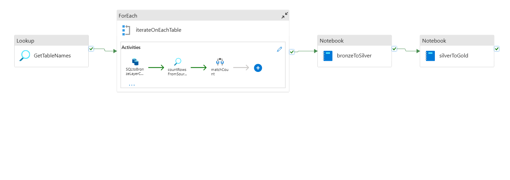
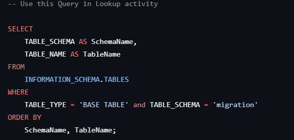
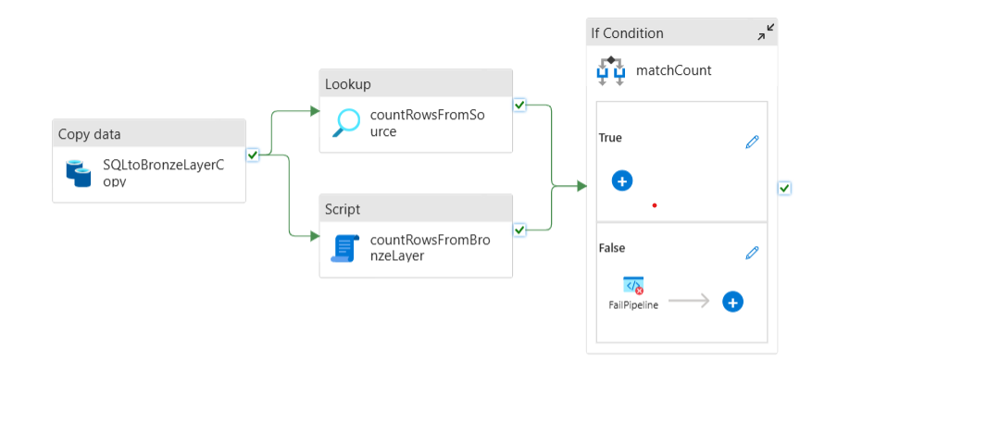
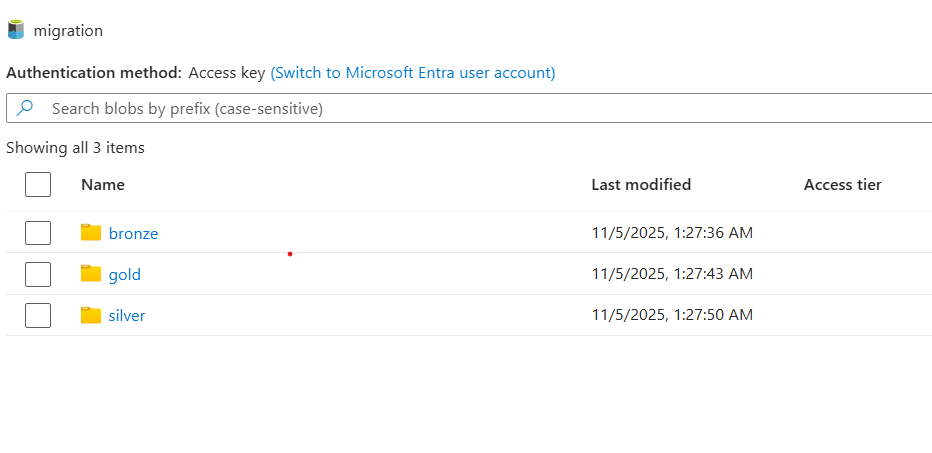
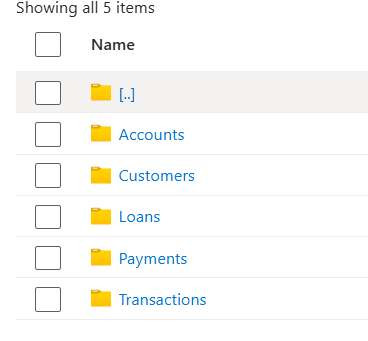

# Azure Data Migration Pipeline with Medallion Architecture

#### End-to-End Data Migration & Transformation Pipeline with Medallion Architecture using Azure Data Factory, ADLS, and Synapse

## 🚀 Project Overview
This project showcases a data migration and transformation pipeline integrated with **Medallion Architecture (Bronze → Silver → Gold)** built on the Azure Synapse, for scalable and structured data processing.
It demonstrates how data can be migrated from Azure SQL Database, stored in Azure Data Lake Storage (ADLS) with **sanity check** (count check), and then transformed into **Medallion Architecture** — ensuring data quality, validation, and parallel processing.

## 🧮 Pipeline Workflow

**Migrate & Load to Bronze:**

  - Copy activity pulls data from Azure SQL tables

  - Parallel copy for all 5 tables

  - Row-count validation ensures data completeness

**Transform Bronze → Silver:**

  - Notebook 1 runs automatically

  - Cleans data and processes and validates data 

**Transform Silver → Gold:**

  - Notebook 2 generates fact, dimension, and aggregated data

  - Ready for analytics consumption

## 🏗️ Architecture Overview
1.🥉 Bronze Layer — Raw data migrated directly from source (Azure SQL Database).

2.🥈 Silver Layer — Data transformation and cleaning.

3.🥇 Gold Layer — Business-ready data containing fact, dimension, and aggregated tables.

**1. First I have created dummy schema and five tables in Azure SQL Database.**
The sql queries can be found -> [sql_queries.sql](sql_queries.sql)

**2. Next let us go through the Pipeline that I've created in Synapse**

- First I've used the **Lookup activity** to get table and shema names. The query can be found -> [sql_query_for_lookup_activity.sql](sql_query_for_lookup_activity.sql)
  

- Second I've used the **For Each** activity
  1. Inside First I've used the **Copy Data activity**. this copies the table from source to ADLS
     
  

  After this I had to create an  database and an External data source on the ADLS container. 

  2. Then i've used the **Look Up & Script** activity to count the records from source and the sink
  3. Finally I've used **IF Condition** activity to check if the count from both activities are same, if not I have chosen to Fail the Pipeline

  **After this the structure in ADLS looks like**
  
  migration/ 
  | 
  |--bronze/ 
    &emsp;| 
    &emsp;|--migration/ 
    &emsp;&emsp;&emsp;|-- Accounts/ 
    &emsp;&emsp;&emsp;|&emsp;&emsp;|--Accounts.parquet 
    &emsp;&emsp;&emsp;|--Customers/ 
    &emsp;&emsp;&emsp;|&emsp;&emsp;|--Customers.parquet 
    &emsp;&emsp;&emsp;|--Loans/ 
    &emsp;&emsp;&emsp;|&emsp;&emsp;|--Loans.parquet 
    &emsp;&emsp;&emsp;|--Payments/ 
    &emsp;&emsp;&emsp;|&emsp;&emsp;|--Payments.parquet 
    &emsp;&emsp;&emsp;|--Transactions/ 
    &emsp;&emsp;&emsp;|&emsp;&emsp;|--Transactions.parquet

**3. Finally I have added 2 Pyspark notebooks for bronze to silver and silver to gold layer transformation**
The note-books can be found below :
1. [bronzeToSilver.ipynb](bronzeToSilver.ipynb)
2. [silverToGold.ipynb](silverToGold.ipynb)

**After the Pipeline has run successfully the structure of the contailes looks like this.**

The silver layer contains

The gold layer contains

## 🧠 Tech Stack

- Azure Synapse Analytics

- Azure SQL Database

- Azure Data Lake Storage Gen2

- Azure Notebook (PySpark)

- ADLS

## Conclusion

This project demonstrates a Azure Synapse Pipeline built for Data Migration intergrated with medallion Architecture ensuring data quality, validation, and parallel processing.

BY RAHUL MONDAL
[LINKEDIN](https://www.linkedin.com/in/rahul-mondal08/)
You can check out video [here]()
EMAIL - mondal.rahul1999@gmail.com

